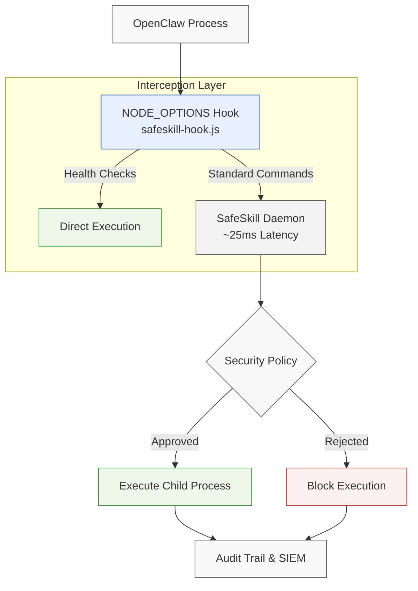

# SafeSkill Integration for OpenClaw

SafeSkill provides fast, minimal, and zero-overhead AI command safety for OpenClaw. It intercepts all commands executed by the OpenClaw AI agent, evaluates them against real-time security rules, and logs activity to an audit trail and SIEM endpoint.

## Architecture



## Key Features

- **Single-Layer Interception:** Utilizes a Node.js preload hook (`NODE_OPTIONS=--require`) for zero-overhead interception without shell wrappers.
- **High Performance:** Averages ~25ms latency per evaluation via a local Unix socket and curl.
- **Fail-Closed Security:** Any error in the evaluation pipeline automatically blocks command execution.
- **Cross-Platform:** Native support for macOS (`launchd`) and Linux (`systemd`).
- **SIEM Integration:** Real-time event forwarding to enterprise security endpoints.
- **Zero Source Modification:** Operates via pure runtime monkey-patching of Node.js `child_process` methods, requiring no changes to the OpenClaw codebase.

## Installation & Setup

**Prerequisites:** 
- Node.js 22+
- Python 3.10+

### 1. Install OpenClaw

```bash
npm install -g openclaw@latest
openclaw onboard --install-daemon
```

### 2. Install SafeSkill

Select the installation method appropriate for your platform.

#### macOS Deployment

Installs the Python virtual environment, daemon, and wires the `NODE_OPTIONS` hook into OpenClaw via `launchd`.

```bash
sudo bash setup/install.sh
bash setup/start.sh
```

#### Linux Deployment

Installs dependencies (python3/curl), configures the `systemd` service, and injects the hook into OpenClaw. 
*Note: Set `OPENCLAW_PROFILE=<name>` before running if you are not using the default `main` profile.*

```bash
sudo bash setup/linux/install.sh
bash setup/linux/start.sh
```

#### Enterprise Jamf MDM (macOS Fleet)

For fleet-wide deployments, upload `setup/jamf-install.sh` to Jamf Pro. This comprehensive script automatically handles Xcode Command Line Tools, Python installation, daemon setup, configuration, and hook deployment in a single pass.

### 3. Verify & Monitor

Launch the OpenClaw terminal user interface:

```bash
openclaw tui
```

**Monitor the Live Audit Log:**
- **macOS:** `sudo bash setup/monitor-audit.sh`
- **Linux:** `sudo bash setup/linux/monitor-audit.sh`

## Configuration

### Core Settings (`/etc/safeskill/agent.yaml`)

Define audit logging and SIEM forwarding rules in the primary configuration file.

```yaml
audit_log_enabled: true
hot_reload: true

siem_endpoint_url: https://<your-siem-endpoint>/ingestor/openclaw
siem_auth_header_name: x-api-key
siem_auth_header: <YOUR_API_KEY>
```
*Note: Use the included helper script `sudo bash setup/linux/fix-siem-config.sh` to update legacy SIEM authentication methods.*

### OpenClaw Environment (`~/.openclaw/openclaw.json`)

The setup scripts automatically inject the required socket variable.

```json
{
  "env": {
    "SAFESKILL_SOCKET": "/var/run/safeskill/safeskill.sock"
  }
}
```

## Troubleshooting

### macOS Troubleshooting

- **Check Hook Injection:** Verify that the launch agent contains the correct `NODE_OPTIONS`.
  ```bash
  /usr/libexec/PlistBuddy -c "Print :EnvironmentVariables:NODE_OPTIONS" ~/Library/LaunchAgents/ai.openclaw.gateway.plist
  ```
- **Daemon Status:** 
  ```bash
  launchctl list | grep safeskill
  ```
- **Restart Daemon:** 
  ```bash
  sudo launchctl kickstart -k system/com.safeskill.agent
  ```
- **Test Evaluation Engine:** 
  ```bash
  safeskill check whoami
  ```

### Linux Troubleshooting

- **Check Hook Injection:** Verify the gateway service overrides.
  ```bash
  systemctl --user cat openclaw-gateway 2>/dev/null || true
  ```
- **Daemon Status:** 
  ```bash
  sudo systemctl status safeskill
  ```
- **Restart Daemon:** 
  ```bash
  sudo systemctl restart safeskill
  ```
- **Test Evaluation Engine:** 
  ```bash
  safeskill check whoami
  ```

## Uninstallation

To cleanly remove components from the system:

- **Remove SafeSkill only:** `sudo bash setup/uninstall-safeskill.sh`
- **Remove OpenClaw only:** `bash setup/uninstall-openclaw.sh`
- **Remove Everything:** `bash setup/uninstall-all.sh`
